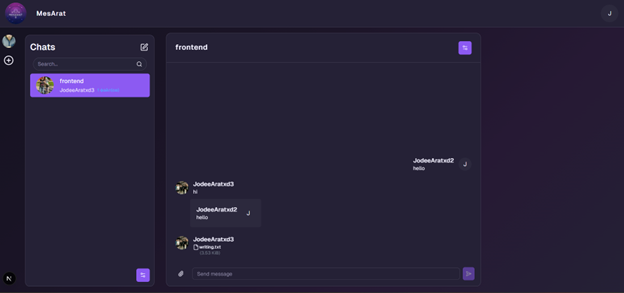
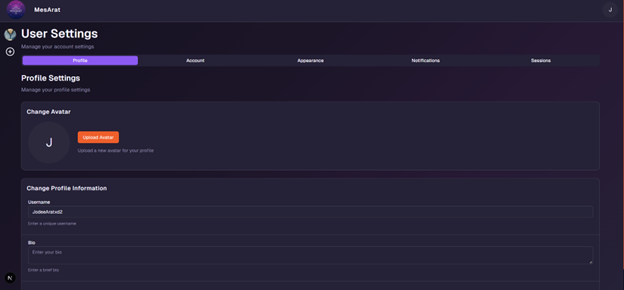

# MesArat

MesArat is a modern web application for secure messaging that leverages advanced cryptographic algorithms and provides real-time communication via GraphQL subscriptions. This project is designed primarily for companies to efficiently manage employee communications and subdivisions, while also being perfectly suitable for individual users seeking a private and convenient messaging platform.

---

## 🚀 Key Features

- 🔑 **User registration and login**
- 💬 **Creating and participating in chats**
- 🗂️ **Group creation with subdivisions:**

  - Create company groups and multiple chats within them
  - Add specific users to groups to organize teams and departments, for example:
    - MesArat company group
    - Frontend team chat
    - Backend team chat
    - General chat
    - News chat, and more

- ✉️ **Advanced messaging functionality:**

  - Reply to messages for better context
  - Forward messages between chats and users
  - Pin important messages for quick access

- 📁 **Send files and attachments along with messages**
- ♻️ **Delete messages**
- 🕒 **Real-time communication:** instant delivery of messages and notifications via GraphQL subscriptions
- 🔔 **Notifications for new messages and events**

---

## ⚙️ Settings and Personalization

- Manage chat, group, and user settings:
  - Change avatars, names, descriptions, and bios
  - Create an informative and comfortable communication environment

---

## 🔒 Security and Future Plans

MesArat is built with a strong focus on security and privacy. Upcoming features include:

- **Secret chats** with end-to-end encryption for maximum privacy
- **Advanced user protection**, including two-factor authentication and enhanced privacy controls
- Audit and control capabilities for corporate accounts to comply with security policies

---

## 📸 Interface Screenshots

### Main Chats and Groups Screen, Message View and Sending

### User and Group Settings

_(Replace image paths with actual screenshots)_

---

## 💡 Usage Examples

### Registration and Login

- Register using email and password
- Log in to start chatting and creating your own groups and chats

### Creating Groups and Chats

- Create a new group
- Create multiple chats inside the group
- Add only users who should have access to these chats

### Sending and Managing Messages

- Send messages with text and attachments
- Reply to specific messages for context
- Forward messages between chats
- Pin important messages for easy access
- Delete messages when necessary

---

## 🛠️ Technology Stack

- **Frontend:** React 19 + TypeScript — modern, type-safe UI development
- **State management:** Zustand and React Hook Form for efficient state and form handling
- **GraphQL:** Apollo Client with subscriptions for real-time data flow
- **File uploads:** apollo-upload-client
- **UI components:** Radix UI (Avatar, Dialog, Dropdown Menu, Tabs, Toast, Tooltip, etc.) and Geist UI for polished, accessible components
- **Styling:** TailwindCSS with class-variance-authority and tailwind-merge for utility-first, responsive design, plus animations via tw-animate-css
- **Validation:** Zod schema validation integrated with React Hook Form
- **Internationalization:** next-intl for multilingual support
- **Theming:** next-themes for light/dark mode support
- **Notifications:** sonner library for toast notifications
- **Build and tooling:** Next.js 15 with ESLint, Prettier (including sorting imports), TypeScript 5, and Parcel watcher for fast development cycles
- **Other utilities:** clsx for conditional class names, dotenv for environment variables, lucide-react icons, input-otp for OTP inputs, and subscriptions-transport-ws for WebSocket GraphQL subscriptions

---

## 🚧 Current Project Status

This is the **final frontend version** before starting mobile application development. The mobile app will retain full functionality with an optimized interface for smartphones and tablets and integrate native device features for enhanced user experience.

---

## 🤝 Contributing

- Reach out for discussions about new features and ideas

---

If you have any questions or suggestions, feel free to reach out!
